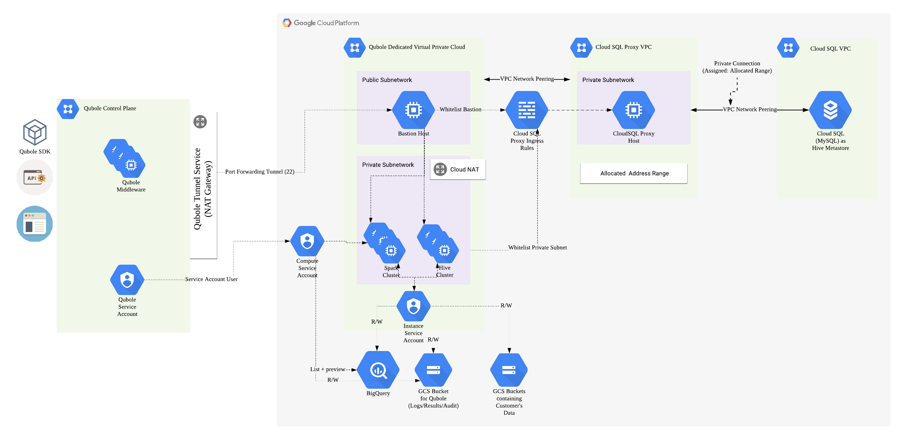

# Cloud Deployment Manager: Qubole Deployment 

<h2>What is <a href="https://cloud.google.com/deployment-manager/">Cloud Deployment Manager</a>?</h2>

    Google Cloud Deployment Manager allows you to specify all the resources needed for your application in a declarative format using yaml. 
    You can also use Python or Jinja2 templates to parameterize the configuration and allow reuse of common deployment paradigms such as a load balanced, auto-scaled instance group. 
    Treat your configuration as code and perform repeatable deployments.

<h2>What is <a href="https://www.qubole.com/">Qubole</a>?</h2>

    Qubole is a Single platform for end-to-end big data processing
    It is the only cloud-native platform to deliver deep analytics, AI, and machine learning for your big data. 
    It provides easy-to-use end user tools such as SQL query tools, notebooks, and dashboards that leverage powerful open source engines. 
    Qubole provides a single, shared infrastructure that enables users to more efficiently conduct ETL, analytics, and AI/ML workloads 
    across best-of-breed open source engines including Apache Spark, TensorFlow, Presto, Airflow, Hadoop, Hive, and more.

<h2>What is the purpose of this project?</h2>

    When an organization or a customer wants to use Qubole on GCP, they need to integrate their GCP Project with Qubole. This includes
    
    * IAM permissions
        * Compute
        * Storage
        * Big Query
    * Dedicated networking components
        * VPC Network
        * Subnetworks
        * Firewall Rules
        * NAT Gateways
    * Hive Metastore
    
    That said, The purpose of this project is two-fold
    1. Create IAM Roles, Service Accounts and Policies that 
        i. Allow Qubole to Create Clusters and perform complete life cycle management
        ii. Allow the clusters to write audit data, command logs/results/resources onto Google Cloud Storage
        iii. Allow the clusters to read data from Big Query
    2. Create infrastructure dedicated for use by Qubole(hence isolating it from other resources)
        i. A dedicated VPC network with a public and private subnet
        ii. A bastion host for securing communications with Qubole
        iii. A NAT Gateway to secure outbound communications in the private subnet
        iv. Associated firewall rules to secure inter-component communications
        
    Additionally, the project also contains templates to spin up a Hive Metastore if the customer or organization does not already have one.
    The templates will do the following
    1. Create a Cloud SQL Instance (MySQL Gen 2) with a database configured as the Hive Metastore
    2. Create a GCE VM and run Cloud SQL Proxy on it, creating a proxy connection to the Cloud SQL instance
    3. Additionally, the templates will whitelist the private subnet and bastion host to be able to access the Cloud SQL Proxy

       

<h2>How does the integration look like?</h2>

    

<h2>How to use the project?</h2>

    All the templates are python templates in the py_templates folder. Each template has detailed documentation on its purpose in life and its use to the Qubole deployment
    The deployment configurations are in the configurations folder.

    The configurations are divided into two sections
    1. The account setup which will
        i. Setup a custom compute role with minimum compute permissions
        ii. Setup a custom storage role with minimum storage permissions
        iii. Setup a service account that will act as the Compute Service Account
        iv. Setup a service account that will act as the Instance Service Account
        v. Authorize the Qubole Service Account to be able to use the Compute Service Account
        vi. Authorize the Compute Service Account to be able to use the Instance Service Account
        vii. Authorize the Service Accounts to be able to read Big Query Datasets
        viii. Create a Cloud Storage Bucket which will be the account's Default Location
    2. The infrastructure setup which will
        i. Setup a VPC Network with a public and private subnet
        ii. Setup a Bastion host in the public subnet and whitelist Qubole ingress to it
        iii. Setup a Cloud NAT to allow clusters spun up in the private subnet access to the internet
        iii. Setup a Cloud SQL Instance hosting the Hive Metastore, exposed via a Cloud SQL Proxy Service
        iv. Peer the Cloud SQL Proxy VPC to the Qubole Dedicated VPC for secure access
        iv. Whitelist Bastion ingress and private subnet ingress to the Cloud SQL Proxy Service

    1. Setup the account IAM as follows
        `gcloud --verbosity=warning deployment-manager deployments create deployment-qubole-account --config account-setup.yaml`
    2. Update your Qubole Account with the newly minted
        i. Compute Service Account
        ii. Instance Service Account
        iii. Default Location
    3. Setup the rest of the infrastructure as follows
        `gcloud --verbosity=warning deployment-manager deployments create deployment-qubole-infra --config infrastructure-setup.yaml`
    4. Update your Qubole Account with configuration for connecting to the metastore. You will need the newly minted
        i. Internal IP of the GCE hosting the cloud SQL proxy service
        ii. Credentials of the Hive Metastore user
        iii. External IP of the bastion host
        iv. User Name of the user allowed to be accessed by Qubole
    5. Create new clusters in your Qubole Account. You will need the newly minted
        i. VPC network name
        ii. Private Subnetwork name
        iii. External IP of the bastion host

That's all folks
